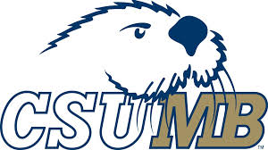

# CSU Monterey Bay - Super Smah Bros Ultimate Cognitive Research

## Live demo and site

Our github pages site can be found [here](https://xxdunedainxx.github.io/CSUMB_SSBU_Study/)

See links below for demos of our experiments:

English:

* [TaskSwitching](https://xxdunedainxx.github.io/CSUMB_SSBU_Study/site/TaskSwitching.html)
* [Reaction times](https://xxdunedainxx.github.io/CSUMB_SSBU_Study/site/SimpleReactionOnly.html)
* [Posner Queues](https://xxdunedainxx.github.io/CSUMB_SSBU_Study/site/Posner.html)
* [Go No go](https://xxdunedainxx.github.io/CSUMB_SSBU_Study/site/GoNoGo.html)

Japanese:

* [Reaction times](https://xxdunedainxx.github.io/CSUMB_SSBU_Study/site/SimpleReactionOnlyJapanese.html)

## General Info 

Experiment code for a 'Super Smash Bros Ultimate', cognitive research study, where we are attempting to observe various cognitive capabilities in relationship to players of super smash brothers. This experiment is being conducted at [CSU Monterey Bay](https://csumb.edu/).

Experiments are built on top of the [psytoolkit](https://www.psytoolkit.org/). 

## Navigation of the repository

Experiment code can be found under `experiments`, of which there are two different directories to be mindful of:

1. `experiments/compiled`: Contains runnable versions of the experiments, which are effectively MASSIVE html files containing all of the experiment logic (in vanilla JavaScript) & the needed HTML to render the experiment UI. For more info on the compiled experiments, see [here](experiments/compiled/README.md)

2. `experiments/psytoolkit`: Contains the psytoolkit scripts which are eventually transpiled into the massive HTML files explained above. For more information on the scripts, see [here](experiments/psytoolkit/README.md)

