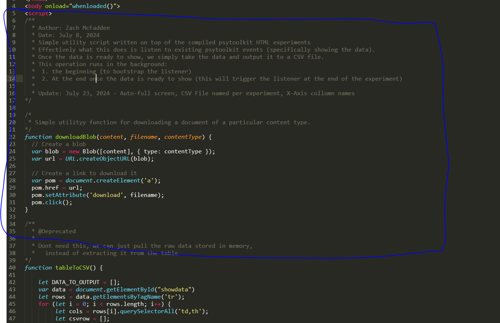

# CSUMB SSBU Study - Psytoolkit modifications 


This document is an overview of the small modifications made to the psytoolkit HTML files, and a general overview of how to get these mods into the experiments. 

Mod features:
* Automatic CSV download upon experiment completion 
* Custom landing page/experiment start screen injection (if you want a custom bitmap on start screen, you will need to see method `loadWelcomeImageBitMap` and replace the `welcomeImageBitMap` with your own base64 encoded image string).

Once you have transpiled and downloaded the experiments, if you want support of our mod, you will need to follow these set of steps. 

1. Copy [our mod script](ZPsyToolkitMod.js) to your clipboard.
2. Under the main `body` block of the experiment, but a new `<script></script>` block, and inject the mod script there, see screen shot: 



3. Next, we'll need to call a couple of custom functions in the experiment. Find the defintion for the psytoolkit `whenloaded` function, and add the follow function calls:

```javascript
// Automatic download
initCustomDataLoader();

// Custom image 
loadWelcomeImageBitMap();
```

See below for a full working example: 

```javascript
function whenloaded(){
tmp1 = document.getElementById('exp');tmp2 = tmp1.getContext('2d');tmp2.fillStyle='red';tmp2.fillRect(175,125,450,350);tmp2.fillStyle='yellow'; tmp2.font='24px Arial'; tmp2.textAlign='center'; tmp2.fillText('Click to start',400,300); window.addEventListener('mousedown', tmpmouse, false)
var canvasbox=document.getElementById('cbox');
iswebkit=RegExp('webkit').test(navigator.userAgent.toLowerCase());
canvasbox.addEventListener(iswebkit?'webkitfullscreenchange':'fullscreenchange', (event) => {if(document.fullscreenElement==null){psy_screen_scale(0,false);}})

// Automatic download
initCustomDataLoader();

// Custom image 
loadWelcomeImageBitMap();

}
```

The idea here is, `whenloaded` is effectively `main` for the experiment, and is configured to run when the `body` of the experiment is loaded up. 

Now if you load up the experiment, it should automatically download a CSV of the results upon completion of the experiment. 