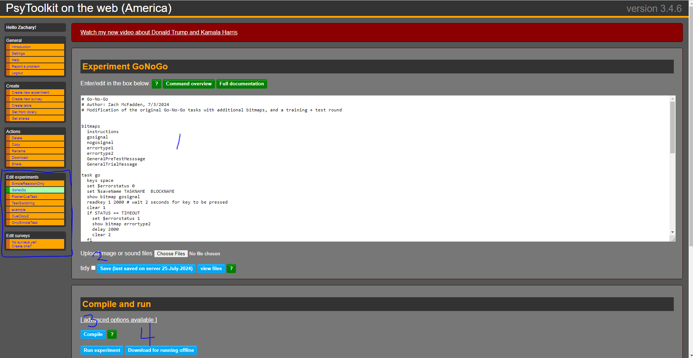

# CSUMB SSBU Study Psytoolkit

This section is an overview of psytoolkit as it is relevant to this research study. 

I'll defer to [psytoolkit's site](https://www.psytoolkit.org/) for information regarding the tool, but it is effectively a software platform for building & running various common cognitive tests. 

## Experiments Overview 

**NOTE**: These experiments utilize the `.py` file extension, commonly used for python syntax highlighting. THESE ARE **NOT** python scripts. I simply named them as such in order to exploit python syntax highlighting, since the psytoolkit scripting language shared some commonalities with python. 

* [Go No Go](GoNoGo.py) - Test inhibitory control in participants, see more [here](https://en.wikipedia.org/wiki/Inhibitory_control)
* [Posner Cue Task](PosnerCueTask.py)- See [here](https://en.wikipedia.org/wiki/Posner_cueing_task)
* [Simple reaction task](SimpleReactionTaskk.py) - Test participant reaction time 
* [Task Switching](TaskSwitching.py) - Task switching, or set-shifting, is an executive function that involves the ability to unconsciously shift attention between one task and another. See more information [here](https://en.wikipedia.org/wiki/Task_switching_(psychology))

## Running Psytoolkit experiments

Again, i'll refer to psytoolkit's **ok** documentation [here](https://www.psytoolkit.org/#_online_documentation). 

But effectively, here are the basic steps if you want to compile new versions of the scripts provided in this project:

1. [Create an account & login](https://us.psytoolkit.org/c/3.4.6/login) - note, this is the American psytoolkit server. They also have a European cluster. This process will work on either 

2. Create the experiment: 

3. Now you can 1: edit the script in the browser, 2: save the script, 3: compile the script (converts/transpiles it to HTML), 4: Download the workable experiment. **NOTE**: the compiler will give you syntax errors if you mess something up :)

